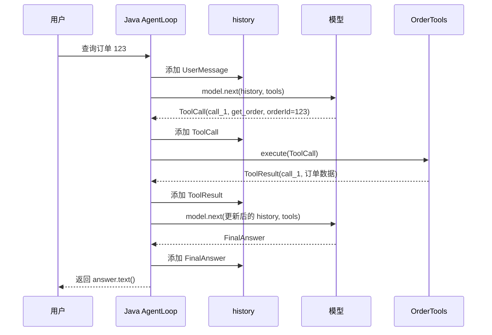

# L01：脚本化工具调用循环复盘

> 代码进度：已完成  
> 复盘状态：已完成（口述检查 5/5）  
> 对应代码：`course/java/lesson_01/`

## 核心概念

请用自己的话回答，每题控制在 2-4 句。

1. 在工具调用循环中，模型负责什么，Java 程序负责什么？
模型根据用户问题、消息历史和工具定义，生成结构化的工具调用请求或最终回答。Java 负责调用模型、按顺序维护历史、校验并执行允许的工具、回填工具结果，以及控制调用预算和结束条件。
2. 为什么消息历史要按 `UserMessage -> ToolCall -> ToolResult -> FinalAnswer` 的顺序保存？
消息历史是下一次模型调用的执行上下文。这个顺序让模型知道用户提出了什么问题、自己请求了什么工具、工具返回了什么结果，并基于完整事实继续决策；有序记录也便于排查问题。
3. `callId` 解决了什么问题？如果一次响应里有多个工具调用，它为什么更重要？
`callId` 关联 `ToolCall` 和 `ToolResult`。多个工具调用同时存在时，Java 原样传递每个 `callId`，保证每个结果回填到对应请求，防止模型把结果解释到错误的调用上。
4. `maxModelCalls` 限制的是什么？为什么最终回答也占用一次模型调用？
`maxModelCalls` 限制一次 `run()` 最多执行多少次 `model.next()`。最终回答本身由一次 `model.next()` 产生，因此自然占用一次额度；整体预算负责终止持续调用工具的循环。
5. 模型直接返回 `FinalAnswer` 和返回 `ToolCall` 时，程序分别怎样处理？
`ToolCall` 分支先记录调用，再由 Java 校验并执行工具，随后记录同 `callId` 的 `ToolResult`，进入下一轮模型调用。`FinalAnswer` 先进入历史，再由 Java 返回其中的文本并结束本次任务。

## 执行流程

请画出“查询订单 123”的完整时序图，必须包含：用户、Java AgentLoop、模型、订单工具、消息历史，以及两次模型调用。



然后用一段话解释：每一步产生了哪类消息，下一步为什么需要它。
第一次调用模型前，历史只有 `UserMessage`；模型返回 `ToolCall` 后，Java 将它加入历史，执行一次订单工具，并将同 `callId` 的 `ToolResult` 加入历史。第二次调用模型时，模型看到 `UserMessage`、`ToolCall` 和 `ToolResult`，据此生成 `FinalAnswer`；Java 记录并返回最终文本。整个过程调用模型两次，执行订单工具一次。

## 踩坑记录

回忆本课出现过的三个问题，分别填写“现象 -> 根因 -> 正确逻辑”。

1. 收到 `FinalAnswer` 后程序仍然报错。
2. 模型调用次数存在边界偏差。
3. 调用预算耗尽后仍抛出练习占位异常。

<!-- 彦祖填写，重点写根因和正确逻辑。 -->
1. 现象：模型已经返回 `FinalAnswer`，程序仍继续执行并最终报错。根因：分支只记录消息，没有结束 `run()`。正确逻辑：记录 `FinalAnswer` 后立即返回 `answer.text()`。
2. 现象：`maxModelCalls` 为 3 时只调用模型 2 次。根因：计数从 1 开始，却使用了排除上界的循环条件。正确逻辑：每轮精确对应一次 `model.next()`，使用 `i <= maxModelCalls`。
3. 现象：预算耗尽时抛出的练习占位异常无法表达真实原因。根因：循环后的占位逻辑尚未替换。正确逻辑：抛出带明确调用上限的 `IllegalStateException` 并结束任务。

## 关键代码片段

从 `AgentLoop.run()` 选择不超过 10 行、最能体现循环机制的代码，并解释每一行承担的职责。

```java
for (int i = 1; i <= maxModelCalls; i++) {
    ModelReply reply = model.next(history, tools.definitions());
    history.add(reply);
    if (reply instanceof ToolCall call) {
        ToolResult result = tools.execute(call);
        history.add(result);
    } else if (reply instanceof FinalAnswer answer) {
        return answer.text();
    }
}
```

循环的每一轮对应一次模型调用。模型回复先进入历史；`ToolCall` 分支执行工具并回填结果，`FinalAnswer` 分支返回文本并结束。循环正常耗尽表示任务仍未完成，随后由明确异常报告调用预算已经用完。
代码索引：

- `course/java/lesson_01/AgentLoop.java`：循环编排与结束条件
- `course/java/lesson_01/LessonTypes.java`：消息和接口契约
- `course/java/lesson_01/LessonSupport.java`：预设模型与订单工具

## 遗留问题

暂无。L3 将继续验证真实 API 的工具 JSON Schema，以及一次响应包含多个工具调用时的消息结构。

## 口述检查

- [x] 不看代码，90 秒讲清一次完整工具调用循环。
- [x] 说明模型为什么只提出调用请求，工具执行权为什么属于 Java。
- [x] 说明 `ToolCall` 与 `ToolResult` 为什么都要进入历史。
- [x] 说明 `callId` 错配会产生什么后果。
- [x] 说明如何阻止模型无限调用工具。

## 完成条件

- [x] 五个核心问题均用自己的话回答。
- [x] 时序图和流程解释完整。
- [x] 三个踩坑均写清根因。
- [x] 口述检查至少通过 4 项。
- [x] 关键知识点已同步到 `key-points.md`。
