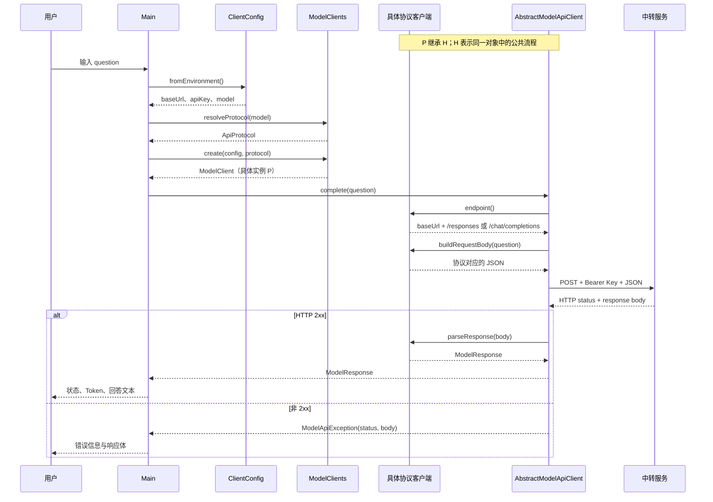

# L02：真实模型双协议客户端复盘

> 代码进度：已完成  
> 复盘状态：进行中  
> 对应代码：`course/java/lesson_02/`

## 核心概念

请用自己的话回答，每题控制在 2-4 句。

1. `ModelClient`、`AbstractModelApiClient` 和两个协议实现分别承担什么职责？
2. Responses 与 Chat Completions 在端点、请求体和文本响应路径上有什么差异？
3. 当前程序怎样选择协议？为什么模型名前缀只能作为当前中转的路由约定，仍需保留手动覆盖？
4. 为什么 API Key 只放在当前 PowerShell 进程的环境变量中？
5. 收到 HTTP 401、HTTP 404、HTTP 5xx 和 HTTP 200 业务错误时，应分别从哪一层定位？

### 我的回答

1. `ModelClient` 向调用方提供稳定契约，统一暴露普通问答、请求体构造、端点查询和资源关闭能力，并统一返回 `ModelResponse`。`AbstractModelApiClient` 固定鉴权、连接与请求超时、HTTP 发送、线程中断标记恢复、IO 异常及非 2xx 处理；两个具体客户端只实现各自的端点、JSON 请求结构和响应解析路径。当前 `endpoint()` 与 `buildRequestBody()` 同时服务 DryRun 和诊断，`close()` 提供统一生命周期入口。
2. Responses 使用 `POST /responses`，请求核心字段是 `model` 和 `input`，文本来自 `output[*].content[*]` 中所有 `type=output_text` 的 `text`。Chat Completions 使用 `POST /chat/completions`，请求核心字段是 `model` 和 `messages`，文本来自 `choices[0].message.content`。
3. `ModelClients` 先读取 `OPENAI_API_PROTOCOL`：显式配置具有最高优先级；缺省时，当前中转约定 `gpt-` 前缀走 Responses，其余模型走 Chat Completions。模型名前缀属于当前中转的经验路由，手动覆盖为新增模型、特殊渠道和中转规则变化提供确定选择。它只解析协议并创建对应客户端，模型请求由客户端执行。
4. API Key 通过当前 PowerShell 进程的环境变量注入，代码、README 和版本库只保存变量名。关闭当前 PowerShell 会话后该进程级变量随进程结束，能够缩小凭证留存范围；正式生产环境应接入专用密钥管理服务。
5. HTTP 401 优先检查配置与鉴权，包括 Key 的存在性、有效性和权限；HTTP 404 优先检查 Base URL、端点、协议和模型渠道映射；HTTP 5xx 优先检查中转或上游服务状态，并结合响应体决定重试策略。HTTP 200 表示传输层成功，其中的 `error` 字段、缺失文本或 JSON 结构差异由具体协议客户端的响应解析层识别。

## 执行流程

请画出“一次真实普通问答”的完整时序图，必须包含：Main、配置读取、协议选择、具体客户端、公共 HTTP 层、中转服务和响应解析。



然后分别写出两个协议的最小请求结构和文本提取路径。

### Responses API

```json
{
  "model": "gpt-5.6-sol",
  "input": "用一句话解释 Agent 的工具调用循环。"
}
```

- 端点：`POST /responses`
- 文本：遍历 `output[*].content[*]`，筛选 `type == "output_text"`，拼接其 `text`
- 状态：根节点 `status`

### Chat Completions API

```json
{
  "model": "glm-5.3-flash",
  "messages": [
    {
      "role": "user",
      "content": "用一句话解释 Agent 的工具调用循环。"
    }
  ]
}
```

- 端点：`POST /chat/completions`
- 文本：`choices[0].message.content`
- 状态：`choices[0].finish_reason`

两种协议最终都转换成 `ModelResponse(id, status, text, totalTokens)`，上层业务因此使用同一返回类型。Responses 的 `output` 是 typed Items 数组，本实现遍历其 `content` 并按 `content.type` 筛选 `output_text`；Chat Completions 的主要输出容器是 `choices`。Responses 的 `status` 与 Chat Completions 的 `finish_reason` 统一存入 `ModelResponse.status`，两者的协议语义和取值范围各自独立。

OpenAI 官方推荐新项目采用 Responses API。本课同时保留 Chat Completions，用于适配当前第三方中转中不同模型渠道的协议能力。

## 踩坑记录

回忆本课出现过的三个问题，分别填写“现象 -> 证据 -> 根因 -> 正确逻辑”。

1. `java`/`javac` 是 17，Maven 却使用了 JDK 8。
2. Windows PowerShell 5.1 解析带中文的 `run.ps1` 时报告括号或大括号错误。
3. `glm-5.3-flash` 请求 `/responses` 返回 404，但请求 `/chat/completions` 成功。

1. **JDK 版本错位**
   - 现象：`java -version` 和 `javac -version` 显示 17，Maven 编译时却使用 JDK 8。
   - 证据：PATH 解析到 JDK 17，原有 `JAVA_HOME` 指向 JDK 8；Maven 启动时采用 `JAVA_HOME`。
   - 根因：命令行 Java 与 Maven 的 JDK 来源不同，环境变量形成了两个运行时视图。
   - 正确逻辑：需要构建时，`run.ps1` 从当前 `java -XshowSettings:properties` 读取 `java.home`，验证其中存在 `bin/javac.exe`，再为当前 PowerShell 进程设置 `JAVA_HOME` 后启动 Maven。

2. **PowerShell 脚本编码错位**
   - 现象：Windows PowerShell 5.1 在中文文本附近报告括号或大括号解析错误。
   - 证据：脚本语法结构完整，移除中文后可解析；无 BOM 的 UTF-8 文件会被 PowerShell 5.1 按系统代码页读取。
   - 根因：脚本字节编码与 PowerShell 5.1 的默认解码规则不一致，中文字符串被错误解码后破坏了词法分析。
   - 正确逻辑：包含中文的 `.ps1` 统一保存为 UTF-8 BOM；当前 `run.ps1` 文件头为 `EF BB BF`。

3. **模型渠道与 API 协议错位**
   - 现象：`glm-5.3-flash` 调用 `/responses` 返回 HTTP 404，改用 `/chat/completions` 后成功。
   - 证据：Base URL、API Key 和模型名保持一致，仅切换端点与请求结构便得到成功响应。
   - 根因：当前中转的 GLM 渠道提供 Chat Completions 兼容接口，Responses 路由未覆盖该渠道。
   - 正确逻辑：显式 `OPENAI_API_PROTOCOL` 优先决定协议；缺省时按当前中转约定路由，`gpt-` 前缀选择 Responses，其余模型选择 Chat Completions。

## 关键代码片段

从协议工厂或公共 HTTP 层选择不超过 10 行的代码，说明它怎样实现“稳定流程复用、协议差异隔离”。

```java
public static ModelClient create(ClientConfig config, ApiProtocol protocol) {
    return switch (protocol) {
        case RESPONSES -> new ResponsesApiClient(config);
        case CHAT_COMPLETIONS -> new ChatCompletionsApiClient(config);
    };
}
```

工厂把“选择哪种协议”集中在一个入口，并始终向 Main 返回 `ModelClient`。两个具体实现继承同一个公共 HTTP 流程，只替换 `endpoint()`、`buildRequestBody()` 和 `parseResponse()` 三个协议变化点；调用方无需了解两种 JSON 结构。新增第三种协议时，需要增加具体客户端与 `ApiProtocol` 枚举值，并扩展工厂分支、自动路由规则和手动覆盖映射。

代码索引：

- `course/java/lesson_02/src/main/java/com/example/agent/lesson02/ModelClient.java`：客户端能力契约
- `course/java/lesson_02/src/main/java/com/example/agent/lesson02/AbstractModelApiClient.java`：HTTP、鉴权、超时与错误处理
- `course/java/lesson_02/src/main/java/com/example/agent/lesson02/ResponsesApiClient.java`：Responses 请求与解析
- `course/java/lesson_02/src/main/java/com/example/agent/lesson02/ChatCompletionsApiClient.java`：Chat 请求与解析
- `course/java/lesson_02/src/main/java/com/example/agent/lesson02/ModelClients.java`：协议选择
- `course/java/lesson_02/src/main/java/com/example/agent/lesson02/ClientConfig.java`：环境配置

## 遗留问题

暂无概念性遗留问题。下一步通过口述检查验证能否脱离代码独立讲清，再根据验收结果补充薄弱点。

## 参考资料

- [OpenAI：Migrate to the Responses API](https://developers.openai.com/api/docs/guides/migrate-to-responses)：Messages/Choices 与 typed Items/Output 的官方对照。
- [OpenAI：Function calling](https://developers.openai.com/api/docs/guides/function-calling)：工具调用流程及 `call_id` 关联方式；下一节继续使用。

## 口述检查

- [ ] 不看代码，说明一次模型请求从配置读取到文本返回的全过程。
- [ ] 现场写出 Responses 与 Chat Completions 的最小请求 JSON。
- [ ] 根据 401、404 和 5xx 判断优先排查方向。
- [ ] 解释抽象公共 HTTP 层的收益与边界。
- [ ] 解释新增第三种协议时需要修改哪些位置。

## 完成条件

- [ ] 五个核心问题均用自己的话回答。
- [ ] 时序图、两种请求结构和响应路径完整。
- [ ] 三个踩坑均写清根因。
- [ ] 口述检查至少通过 4 项。
- [ ] 关键知识点已同步到 `key-points.md`。
