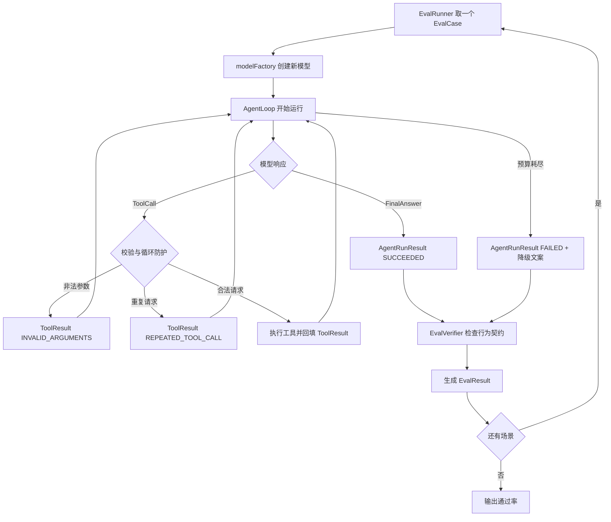

# L04：评测集与循环健壮性复盘

> 代码进度：已完成  
> 复盘状态：已完成（参数回喂流程已完成口述纠偏）  
> 对应代码：`course/java/lesson_03/`  
> 评测结果：7/7，通过率 100%

## 核心概念

1. **评测和单元测试的边界**

   Agent 的最终文字具有不确定性，且中间路径可能很多。只比较最终答案会漏掉错误工具、无效重试、重复调用和预算浪费。评测应该检查用户可见结果、工具调用轨迹、消息历史、调用次数和安全边界。

2. **评测场景的组织方式**

   `EvalCase` 保存问题、限制、模型工厂和验证规则；模型使用工厂在每个场景开始时重新创建，避免响应队列被前一个场景消费。`EvalRunner` 一个场景一个场景运行，`EvalResult` 保存通过状态、失败原因和资源消耗，单个场景失败不会阻断剩余场景。

3. **参数错误回喂**

   工具发现参数错误时，不直接结束 Agent，而是返回带原始 `callId` 的 `ToolResult`。把工具返回放入上下文后继续请求模型，模型根据历史消息进行参数修正；修正后的调用和新的工具结果继续进入历史。

4. **重复调用防护**

   `callId` 只负责关联一次请求和结果，模型重复请求时可以生成新的 `callId`。因此防重复使用工具名和参数的语义指纹，并忽略 `callId`；JSON 参数先解析成 `JsonNode`，让空格等表示差异不绕过检测。重复请求不再执行工具，而是回填 `REPEATED_TOOL_CALL`，给模型机会结束或改变策略。

5. **预算耗尽的降级**

   调用预算是可靠性边界，不是用户可读的异常。预算耗尽时返回 `FAILED` 的结构化结果、降级文案、已消耗的调用计数和截止失败时的历史快照；程序异常仍然抛出，便于定位真正的实现错误。

## 执行流程



一次非法参数自纠的历史顺序是：

```text
UserMessage
ModelTurn（非法参数）
ToolResult（INVALID_ARGUMENTS）
ModelTurn（修正参数）
ToolResult（正确结果）
ModelTurn（最终回答）
```

## 踩坑记录

1. **运行结果对象字段类型错误**

   现象：`AgentRunResult` 把模型调用数和工具调用数误写成消息对象类型，循环也没有填入实际计数。根因是把“调用次数”和“调用记录”混成了两个概念。正确逻辑是用不可变结果对象保存 `finalAnswer`、`status`、`modelCalls`、`toolCalls` 和历史快照。

2. **用户答案和工具协议断言混用**

   现象：订单不存在场景把最终中文回答要求为 `ORDER_NOT_FOUND`，而模型回答的是用户可理解的“未查询到”。根因是把工具内部错误码当成了最终文案。正确逻辑是分别验证 `ToolResult` 的协议错误码和最终回答的业务语义。

3. **重复防护改变了旧多工具夹具的含义**

   现象：旧测试用两个完全相同的 `get_order {}` 请求验证多工具顺序，启用重复防护后第二次请求被拦截。根因是测试夹具本身描述了重复请求，而不是两个不同工具调用。正确逻辑是使用不同订单参数验证顺序，并用专门场景验证重复拦截。

4. **预算测试仍期待异常抛出**

   现象：预算降级实现后，旧 smoke test 仍等待 `AgentLimitExceededException`。根因是执行契约从“异常终止”变为“结构化失败结果”后，测试没有同步更新。正确逻辑是验证 `FAILED`、降级文案、计数和历史快照。

## 关键代码片段

```java
ToolCallKey key = keyOf(call);
if (!seenToolCalls.add(key)) {
    context.append(new ToolResult(
            call.callId(),
            "{\"code\":\"REPEATED_TOOL_CALL\"}"
    ));
    continue;
}
ToolResult result = tools.execute(context, call);
context.append(result);
```

这段代码把重复检测放在工具执行之前：首次请求进入工具，后续语义相同的请求只生成结构化反馈，并保留 `callId` 关联。

代码索引：

- `course/java/lesson_03/EvalCase.java`：评测场景契约
- `course/java/lesson_03/EvalResult.java`：单场评测结果
- `course/java/lesson_03/EvalRunner.java`：逐场运行与通过率汇总
- `course/java/lesson_03/EvalMain.java`：七个可重复评测场景
- `course/java/lesson_03/AgentLoop.java`：参数错误回喂、重复防护和预算降级
- `course/java/lesson_03/AgentRunResult.java`：不可变运行结果

## 遗留问题

- 当前评测使用确定性的 `SequenceModelClient`，验证了循环和边界契约，还没有度量真实模型多次采样下的波动。
- Agent 不变量异常仍由 `EvalRunner` 以 0 次计数记录，后续可以统一失败结果协议以保留更多执行快照。
- 当前重复策略适合只读订单查询；可变工具需要进一步定义重复请求的时间窗口、幂等键和允许重试条件。

## 口述检查

- [x] 解释为什么最终答案正确不代表执行路径可靠。
- [x] 说明正常、边界和对抗场景的覆盖范围。
- [x] 说明重复指纹与 `callId` 的职责边界。
- [x] 说明非法参数如何回到上下文并促成模型自纠。
- [x] 说明预算耗尽时结构化失败结果的价值。
- [x] 说明 `EvalRunner` 如何隔离单场景失败。

## 完成条件

- [x] 评测运行器逐场执行并输出通过率。
- [x] 六个核心场景和一个预算变体全部通过。
- [x] 参数错误回喂和模型自纠已验证。
- [x] 重复调用检测不受新 `callId` 或 JSON 空格影响。
- [x] 预算耗尽返回可用的降级结果。
